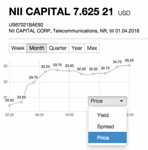

# Карточка облигации

## ОЦЕНКА ЗАДАНИЯ

ESTIMATION TIME: 8h
ACTUAL TIME: 6h*
DIFFICULTY (from 1 to 10): 4

NOTE:
* - в целях экономии своего вермени как было сказано в сопроводительном письме упростил визуальное отображение, чтобы сконцентрировать на архитектурных скиллах и работы с бизнес задачей.
1,5h - подбор данных, искал open api для бондов, но в основном все требуют сложных токенов
2h - провязка данных \ роутов
2h - освоеное chart.js нюансов и конфигураций

## Макет карточки облигации:

## Задача
Создать приложение по макету на основе React и Redux, которое реализует
следующие функции:
- получает данные об облигации из API по идентификатору облигации (ISIN) и
отображает их на карточке,
- позволяет выбрать период за который строится график,
- позволяет изменить параметр, по которому строится график.
Комментарии к задаче
- в качестве основы приложения рекомендуем использовать Create React App
(https://github.com/facebook/create-react-app),
- библиотеку для построения графика можно выбрать любую,
- данные для графика можно сгенерировать случайным образом,
- все спорные моменты решайте в пользу уменьшения времени на выполнения
задания и упрощения кода.
Ожидаемое решение
- код приложения на языке JavaScript в репозитории на GitHub.
